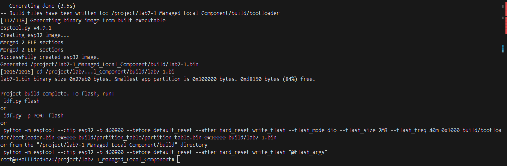

# Lab 7-1: Local Component Demo

## คำอธิบาย
การทดลองนี้แสดงการใช้งาน component ที่มีอยู่ในโฟลเดอร์ `components/Sensors/` ของ project  
โดยมีการเรียกใช้ฟังก์ชัน `sensor_init()`, `sensor_read_data()`, และ `sensor_check_status()`  
เพื่อทดสอบการเชื่อมต่อและการทำงานของ Local Component

## สรุปคำสั่งที่ใช้ และผลลัพธ์ที่ได้

### คำสั่งที่ใช้
```bash
# เข้าไปยังโฟลเดอร์โปรเจกต์
cd lab7-1_Managed_Local_Component

# เตรียม environment ของ ESP-IDF
. $IDF_PATH/export.sh

# กำหนด target เป็น esp32
idf.py set-target esp32

# Build โปรเจกต์
idf.py build

# Flash และเปิด serial monitor (ถ้ามีบอร์ดต่ออยู่)
idf.py -p /dev/ttyUSB0 flash monitor


ผลลัพธ์ที่ได้
